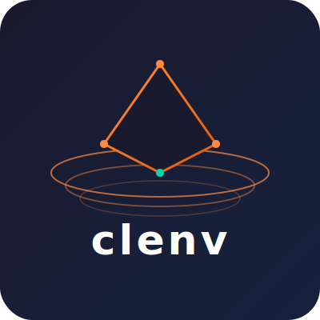

[한국어](README.ko.md) | [English](README.md)

# clenv — Claude Code 환경 관리자

<p align="center">
  
</p>

`clenv`는 여러 개의 Claude Code 프로필을 관리하는 CLI 도구입니다. 각 프로필은 독립적인 `~/.claude` 디렉토리로, CLAUDE.md, MCP 서버, hooks, agents, skills를 별도로 유지하며 git으로 버전 관리됩니다.

## 왜 clenv인가?

Claude Code는 모든 설정을 `~/.claude`에 저장합니다. 워크플로가 복잡해질수록 단일 전역 설정은 문제가 됩니다:

- **업무** 프로젝트에는 엄격한 보안 정책이 필요하고, **사이드 프로젝트**에는 실험적인 도구가 필요합니다.
- **AI 에이전트**를 개발하면서 개발용 환경(다양한 도구 활성화)과 프로덕션 환경(최소한의 도구, 잠금 상태)을 분리해야 합니다.
- 팀의 **표준 기준 설정**을 공유하면서 각자가 개인 설정을 얹어야 합니다.

개발자는 하나의 정체성만 갖지 않습니다. 어떤 프로젝트를 하느냐, 팀에서 어떤 역할을 맡느냐, 어떤 도구를 쓰느냐에 따라 페르소나가 달라집니다. AI 에이전트를 개발하는 개발자에게 필요한 Claude Code 환경은, 같은 사람이 PR을 리뷰하거나 팀원을 온보딩할 때와는 완전히 다릅니다. `clenv`를 쓰면 페르소나마다 프로필을 하나씩 유지하고, 필요할 때 즉시 전환할 수 있습니다.

`clenv`는 각 설정을 독립적이고 버전 관리되는 프로필로 취급해 이 문제를 해결합니다.

## 누가 쓰는가?

### 멀티 컨텍스트 개발자

업무와 개인 프로젝트를 병행하거나, 여러 클라이언트별 환경을 유지해야 하는 개발자. 컨텍스트를 전환할 때 프로필만 바꾸면 됩니다.

```sh
clenv profile use work      # 엄격한 MCP, 회사 CLAUDE.md
clenv profile use personal  # 개방적인 도구, 개인 설정
```

### AI 에이전트 개발자

에이전트를 만들고 반복하는 과정에서 Claude Code 환경 자체가 제품의 일부가 됩니다. 에이전트 구성, MCP 서버 조합, hook 설정은 소스 코드처럼 버전 관리되고 재현 가능해야 합니다.

```sh
clenv profile create agent-dev --from baseline
clenv profile use agent-dev   # 개발 환경: 전체 MCP 서버, 디버그 훅
# ... 에이전트 반복 개발 ...
clenv commit -m "researcher 에이전트 프롬프트 조정"

clenv profile create agent-prod --from agent-dev
clenv profile use agent-prod  # 프로덕션: 최소 MCP 서버, 잠금 상태
clenv tag v1.0 -m "프로덕션 에이전트 설정"
```

프로필에는 Claude Code가 읽는 모든 것이 저장됩니다: `CLAUDE.md`, `settings.json`, `.mcp.json`, `hooks/`, `agents/`, `skills/`. 이 모든 것을 버전 관리하고, 릴리즈에 태그를 달고, 팀원에게 내보낼 수 있습니다.

### 팀

팀 표준 프로필을 유지합니다. 팀원들은 이를 출발점으로 가져와 개인 커스터마이징을 쌓습니다 — 공유 기준선을 잃지 않고.

```sh
# 팀 표준 내보내기
clenv profile export team-standard -o team-standard.clenvprofile

# 가져와서 바로 사용
clenv profile import team-standard.clenvprofile --use
clenv commit -m "개인 키바인딩 추가"
```

---

## 설치

### Homebrew (권장)

```sh
brew tap chaaaamni/clenv
brew install clenv
```

### cargo install

```sh
cargo install clenv
```

### 소스에서 빌드

```sh
git clone https://github.com/chaaaamni/clenv.git
cd clenv
cargo build --release
# 바이너리: ./target/release/clenv
```

---

## 빠른 시작

```sh
clenv init                        # ~/.claude/ 백업 후 default 프로필 생성
clenv profile create work --use   # 프로필 생성 후 즉시 전환
# ... ~/.claude/ 수정 ...
clenv commit -m "초기 work 설정"
```

---

## 사용법

### 초기화

```sh
# clenv 초기화 (설치 후 최초 1회 실행)
# 기존 ~/.claude/ 백업 후 'default' 프로필 생성
clenv init

# 원본 백업을 유지하면서 재초기화
clenv init --reinit
```

### 프로필 관리

```sh
# 새 프로필 생성
clenv profile create work

# 생성 후 즉시 전환
clenv profile create work --use

# 기존 프로필에서 복사해 생성
clenv profile create agent-prod --from agent-dev

# 프로필 목록 보기
clenv profile list

# 프로필 전환 (~/.claude 심볼릭 링크 업데이트)
clenv profile use work

# 현재 활성 프로필 이름 출력
clenv profile current

# 프로필 삭제
clenv profile delete old-profile --force

# 프로필 복제
clenv profile clone work work-backup

# 프로필 이름 변경
clenv profile rename work-backup archived

# clenv 비활성화 — ~/.claude를 실제 디렉토리로 복원
clenv profile deactivate
clenv profile deactivate --purge   # ~/.clenv/ 데이터도 삭제
```

### 버전 관리

각 프로필은 git 저장소입니다. 프로필이 활성화된 상태에서 아래 명령을 사용합니다:

```sh
# 미커밋 변경사항 확인
clenv status

# diff 보기
clenv diff
clenv diff HEAD~1..HEAD     # 커밋 간 비교
clenv diff --name-only      # 파일명만 출력

# 현재 상태 커밋
clenv commit -m "GitHub MCP 서버 추가"

# 특정 파일만 커밋
clenv commit -m "훅 수정" hooks/

# 커밋 히스토리 보기
clenv log
clenv log --oneline
clenv log -n 10             # 최근 10개

# 특정 버전으로 이동
clenv checkout v1.0
clenv checkout abc123f

# 이전 커밋으로 되돌리기
clenv revert

# 특정 커밋으로 되돌리기
clenv revert abc123f
```

### 태그

```sh
# 현재 커밋에 태그 생성
clenv tag v2.0 -m "회사 표준 설정"

# 태그 목록 보기
clenv tag --list

# 태그 삭제
clenv tag v2.0 --delete
```

### 내보내기 / 가져오기

```sh
# 활성 프로필 내보내기
clenv profile export -o my-profile.clenvprofile

# 특정 프로필 내보내기
clenv profile export work -o work.clenvprofile

# plugins, marketplace 제외하고 내보내기
clenv profile export work --no-plugins --no-marketplace

# 프로필 가져오기
clenv profile import my-profile.clenvprofile

# 이름 지정 후 가져와서 즉시 전환
clenv profile import my-profile.clenvprofile --name imported --use
```

> 내보내기 시 MCP API 키가 자동으로 삭제됩니다. 가져온 후 해당 서버의 API 키를 다시 입력해야 합니다.

### 디렉토리별 프로필 (.clenvrc)

Node.js의 `.nvmrc`처럼, `.clenvrc`로 디렉토리마다 프로필을 지정합니다.
우선순위: `CLENV_PROFILE` 환경변수 > `.clenvrc` > 전역 활성 프로필

```sh
# 현재 디렉토리에 프로필 고정
clenv rc set work

# 현재 활성 프로필과 출처 보기
clenv rc show

# 디렉토리 고정 해제
clenv rc unset

# 결정된 프로필 이름 출력 (쉘 스크립팅 용)
clenv resolve-profile
clenv resolve-profile --quiet   # 이름만 출력
```

### 진단

```sh
# 일반적인 문제 감지
clenv doctor

# 문제 감지 후 자동 수정
clenv doctor --fix
```

### 제거

```sh
# clenv 제거 및 원본 ~/.claude/ 복원
clenv uninstall

# 확인 없이 제거
clenv uninstall -y

# 심볼릭 링크만 복원하고 ~/.clenv/ 데이터 보존
clenv uninstall --keep-data
```

---

## 요구 사항

- macOS 또는 Linux
- 추가 의존성 없음 (Homebrew 설치 시 정적 링크 바이너리)

## 쉘 자동완성

```sh
# bash
clenv completions bash >> ~/.bash_completion

# zsh
clenv completions zsh > ~/.zsh/completions/_clenv

# fish
clenv completions fish > ~/.config/fish/completions/clenv.fish
```

## 기여

[github.com/Imchaemin/clenv](https://github.com/Imchaemin/clenv)에서 이슈 및 Pull Request를 환영합니다.

## 라이선스

MIT — [LICENSE](LICENSE) 파일 참고.
